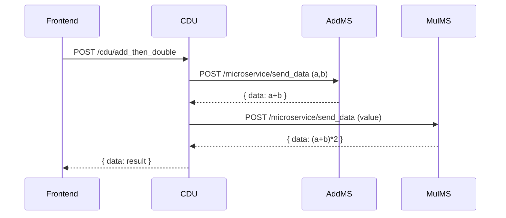

# 🐞 Guía de Ejecución y Depuración

Este documento explica **cómo iniciar, detener y depurar** la calculadora mock de tres servicios dentro del Dev Container, de modo que cualquiera en el equipo trabaje exactamente igual.

> **Ámbito**
> Describe Launch/Attach en VS Code, tareas, trazado HTTP y atajos útiles.
> Se aplica a cualquier clon de este repositorio en Linux o Windows 11 + WSL 2.

---

## 1 · Requisitos previos

| Herramienta         | Versión / Nota                                            |
| ------------------- | --------------------------------------------------------- |
| VS Code             | Última estable + extensión **Dev Containers**             |
| Dev Container       | Definido en `.devcontainer/`                              |
| Dependencias Python | `pip install -r requirements.txt` (dentro del contenedor) |

Una vez clonado el repo, selecciona **“Reopen in Container”**. La barra inferior debe mostrar `Dev Container: …`.

---

## 2 · Dos formas de ejecutar y depurar

| Modo               | Cómo funciona                                                                                                                         | Cuándo preferirlo                                                                                         |
| ------------------ | ------------------------------------------------------------------------------------------------------------------------------------- | --------------------------------------------------------------------------------------------------------- |
| **Launch (F5)**    | VS Code **crea** el proceso Uvicorn *ya conectado* al depurador. Cada F5 reinicia el servicio.                                        | Iteración rápida; no te importa reiniciar.                                                                |
| **Tarea + Attach** | Una tarea shell lanza Uvicorn vía `python ‑m debugpy --listen <puerto>`. El servicio corre normal; te **adjuntas** después (o nunca). | El servicio debe seguir vivo (tests end‑to‑end, docker‑compose) y solo quieres inspeccionar puntualmente. |

Puedes mantener **ambos** y elegir según la situación.

---

## 3 · Configuraciones de lanzamiento (`.vscode/launch.json`)

```jsonc
{
  "version": "0.2.0",
  "configurations": [
    /* ───── servicios en modo launch ───── */
    {
      "name": "Debug - CDU",
      "type": "python",
      "request": "launch",
      "module": "uvicorn",
      "args": ["calc_cdu.main:app", "--host", "0.0.0.0", "--port", "8000", "--reload"],
      "env": { "HTTPX_LOG_LEVEL": "debug" },
      "jinja": true,
      "justMyCode": true
    },
    {
      "name": "Debug - Addition‑MS",
      "type": "python",
      "request": "launch",
      "module": "uvicorn",
      "args": ["addition_ms.main:app", "--host", "0.0.0.0", "--port", "8001", "--reload"],
      "jinja": true,
      "justMyCode": true
    },
    {
      "name": "Debug - Multiply‑MS",
      "type": "python",
      "request": "launch",
      "module": "uvicorn",
      "args": ["multiply_ms.main:app", "--host", "0.0.0.0", "--port", "8002", "--reload"],
      "jinja": true,
      "justMyCode": true
    },

    /* ───── servicios en modo attach ───── */
    {
      "name": "Attach CDU",
      "type": "python",
      "request": "attach",
      "connect": { "host": "localhost", "port": 5673 }
    },
    {
      "name": "Attach Addition‑MS",
      "type": "python",
      "request": "attach",
      "connect": { "host": "localhost", "port": 5671 }
    },
    {
      "name": "Attach Multiply‑MS",
      "type": "python",
      "request": "attach",
      "connect": { "host": "localhost", "port": 5672 }
    }
  ],

  "compounds": [
    {
      "name": "Debug - Todos",
      "configurations": [
        "Debug - Addition‑MS",
        "Debug - Multiply‑MS",
        "Debug - CDU"
      ],
      "stopAll": true
    }
  ]
}
```

**¿Para qué sirven las dos claves nuevas?**

| Clave                   | Propósito                                                                                                                                                      |
| ----------------------- | -------------------------------------------------------------------------------------------------------------------------------------------------------------- |
| `HTTPX_LOG_LEVEL=debug` | Hace que **httpx** escriba una línea `DEBUG` por cada petición y respuesta (URL, cabeceras, JSON, tiempo). Así ves qué envías y qué recibes del microservicio. |
| `justMyCode: true`      | El depurador ignora código de terceros: al hacer *Step Into* o capturar una excepción saltarás directo a tu fuente, no a FastAPI/uvicorn.                      |

---

## 4 · Tareas (`.vscode/tasks.json`)

```jsonc
{
  "version": "2.0.0",
  "tasks": [
    {
      "label": "run‑addition",
      "type": "shell",
      "command": "python -m debugpy --listen 5671 -m uvicorn addition_ms.main:app --reload --port 8001"
    },
    {
      "label": "run‑multiply",
      "type": "shell",
      "command": "python -m debugpy --listen 5672 -m uvicorn multiply_ms.main:app --reload --port 8002"
    },
    {
      "label": "run‑cdu",
      "type": "shell",
      "command": "python -m debugpy --listen 5673 -m uvicorn calc_cdu.main:app --reload --port 8000",
      "options": { "env": { "HTTPX_LOG_LEVEL": "debug" } }
    },
    { "label": "run‑all", "dependsOn": ["run‑addition", "run‑multiply", "run‑cdu"], "dependsOrder": "parallel" }
  ]
}
```

Cada servicio abre su puerto `5671–5673` **esperando** que VS Code se adjunte; no se activan breakpoints hasta que uses *Attach*.

---

## 5 · Flujos de trabajo habituales

### 5.1 Arrancar todo y depurar de inmediato

```text
F5  →  selecciona “Debug ‑ Todos”
```

Los tres servidores arrancan conectados al depurador; cualquier break‑point se dispara.

### 5.2 Mantener servidores vivos y adjuntarte cuando quieras

```text
Run Task…  →  run‑all         # inicia 3 servidores
F5          →  Attach CDU     # te conectas sólo a uno
Shift+F5    →  detienes debug # los servidores SIGUEN corriendo
```

---

## 6 · Trucos rápidos de depuración

| Necesitas…                   | Truco                                                        |
| ---------------------------- | ------------------------------------------------------------ |
| Inspeccionar variables       | **Debug Console** (`Ctrl+Shift+Y`) y escribe Python en vivo. |
| Imprimir sin detener         | Logpoint: clic derecho en el margen → *Insert Logpoint*.     |
| Ver HTTP cuerpo              | Con `HTTPX_LOG_LEVEL=debug` ya se muestra tamaño y JSON.     |
| Parar en cualquier excepción | Panel Run & Debug ⚙️ → *Break on All Exceptions*.            |

---

## 7 · FAQ

**¿Por qué Attach no para en breakpoints?**
Asegúrate de usar la configuración *Attach* correcta (puertos 5671‑5673) y que el breakpoint esté en código cargado.

**Recibo **************\`\`************** al leer la respuesta**
Mira la terminal del CDU: verás un `DEBUG httpx` con `422` que indica que el JSON enviado no coincide con el modelo del microservicio.

---

## 8 · Diagrama de la ruta



Con esta guía cualquier miembro del equipo puede:

1. **Arrancar** la pila mock.
2. **Depurar** toda la cadena o sólo un servicio.
3. **Ver** el tráfico interno y diagnosticar errores en minutos.
